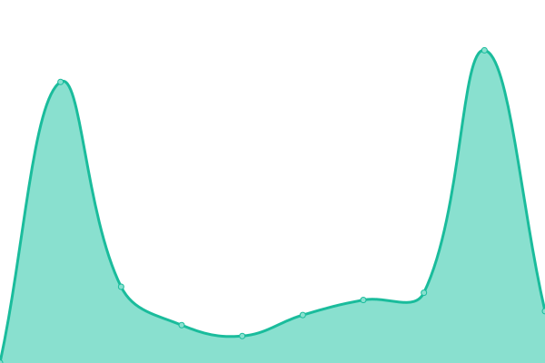

# [📈 Live Status](https://smetmat.github.io/monitor-system/): <!--live status--> **🟧 Partial outage**

This repository contains the open-source uptime monitor and status page for [Upptime](https://upptime.js.org), powered by [Upptime](https://github.com/upptime/upptime).

With [Upptime](https://upptime.js.org), you can get your own unlimited and free uptime monitor and status page, powered entirely by a GitHub repository. We use [Issues](https://github.com/upptime/upptime/issues) as incident reports, [Actions](https://github.com/SMETMAT/uptime/actions) as uptime monitors, and [Pages](https://upptime.github.io/upptime) for the status page.

<!--start: status pages-->
<!-- This summary is generated by Upptime (https://github.com/upptime/upptime) -->
<!-- Do not edit this manually, your changes will be overwritten -->
<!-- prettier-ignore -->
| URL | Status | History | Response Time | Uptime |
| --- | ------ | ------- | ------------- | ------ |
|  [SMETMAT (en site)](https://www.smetmat.cf) | 🟥 Down | [smetmat-en-site.yml](https://github.com/SMETMAT/monitor-system/commits/HEAD/history/smetmat-en-site.yml) | 

 0ms
     
 | 

<a href="https://monitor.smetmat.cf/history/smetmat-en-site">0.01%</a>
    

|  [SMETMAT (th site)](https://xn--12c8b2ayn.cf/) | 🟥 Down | [smetmat-th-site.yml](https://github.com/SMETMAT/monitor-system/commits/HEAD/history/smetmat-th-site.yml) | 

 0ms
     
 | 

<a href="https://monitor.smetmat.cf/history/smetmat-th-site">0.03%</a>
    

|  [TPSO (พลังจิตโอลิมปิก)](https://tpso.memewithyasart.ml/) | 🟩 Up | [tpso.yml](https://github.com/SMETMAT/monitor-system/commits/HEAD/history/tpso.yml) | 

 691ms
     
 | 

<a href="https://monitor.smetmat.cf/history/tpso">100.00%</a>
    

<!--end: status pages-->

[**Visit our status website →**](https://smetmat.github.io/monitor-system/)

## 📄 License

- Powered by: [Upptime](https://github.com/upptime/upptime)
- Code: [MIT](./LICENSE) © [Upptime](https://upptime.js.org)
- Data in the `./history` directory: [Open Database License](https://opendatacommons.org/licenses/odbl/1-0/)
